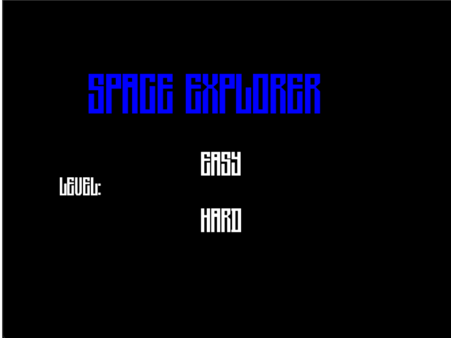
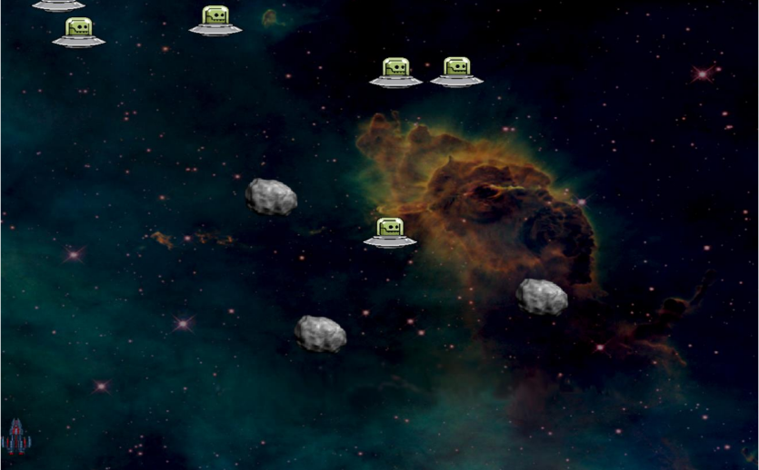
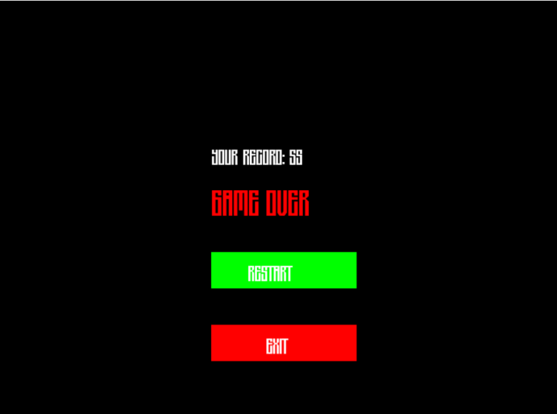

# 🚀 Space Explorer Documentation  
*A 2D Arcade Shooter Game*  

---

## 📜 Table of Contents
- [Introduction](#-introduction)
- [Main Features](#-main-features)
- [Code Structure](#-code-structure)
- [Screenshots](#-screenshots)
- [Future Improvements](#-future-improvements)
- [Installation](#-installation)
- [Team](#-team)
- [License](#-license)

---

## 📖 Introduction  
Space Explorer is a 2D arcade-style shooting game where players control a spaceship navigating through hostile space environments. Key features:

- **Two Difficulty Modes**  
  - *Easy*: Aliens with zigzag patterns  
  - *Hard*: Additional falling rocks  

- **Core Mechanics**  
Movement: W/A/S/D or Arrow Keys
Shooting: Spacebar
Objective: Survive as long as possible

---

## 🎮 Main Features  

### 🕹️ Player Controls  
| Action        | Key               |
|---------------|-------------------|
| Move Up       | W/↑               |
| Move Left     | A/←               |
| Move Down     | S/↓               |
| Move Right    | D/→               |
| Shoot         | Spacebar          |

### 👾 Enemy Behavior  
| Enemy Type | Movement Pattern       | Mode Available  |
|------------|-------------------------|-----------------|
| 👽 Alien   | Zigzag downward         | Easy & Hard     |
| 🪨 Rock    | Straight downward       | Hard Mode Only  |

---

## 💻 Code Structure  

### 🗂️ File Organization  

src/
├── main.cpp
├── Game/
│ ├── Game.hpp
│ └── Game.cpp
├── Player/
│ ├── Player.hpp
│ └── Player.cpp
├── Enemies/
│ ├── Alien.hpp
│ ├── Alien.cpp
│ ├── Rock.hpp
│ └── Rock.cpp

### 🔧 Key Class Responsibilities  
| Class       | Key Methods             | Functionality                      |
|-------------|-------------------------|------------------------------------|
| `Game`      | run(), checkCollisions()| Manages game loop and collisions   |
| `Player`    | handleInput(), shoot()  | Handles movement and shooting      |
| `Alien`     | setZigzag(), update()   | Implements zigzag movement pattern |
| `Rock`      | spawnRocks(), update()  | Manages rock spawning/movement     |

---

## 📸 Screenshots  
| Main Menu | Gameplay | Game Over |
|-----------|----------|-----------|
|  |  |  |

---

## 🔮 Future Improvements  
- Enhanced graphics and animations  
- Sound effects and background music  
- Power-ups (shields, multi-shot)  
- Progressive difficulty levels  

---

## ⚙️ Installation  
1. Clone repository:  

git clone https://github.com/BadreLahlou/SpaceExplorer.git

2 . Install dependencies:

sudo apt-get install libsfml-dev

3.Compile and run:

g++ -o game main.cpp -lsfml-graphics -lsfml-window -lsfml-system && ./game

📜 License 
MIT License
Copyright (c) 2023 Badre Lahlou
Permission is hereby granted...
